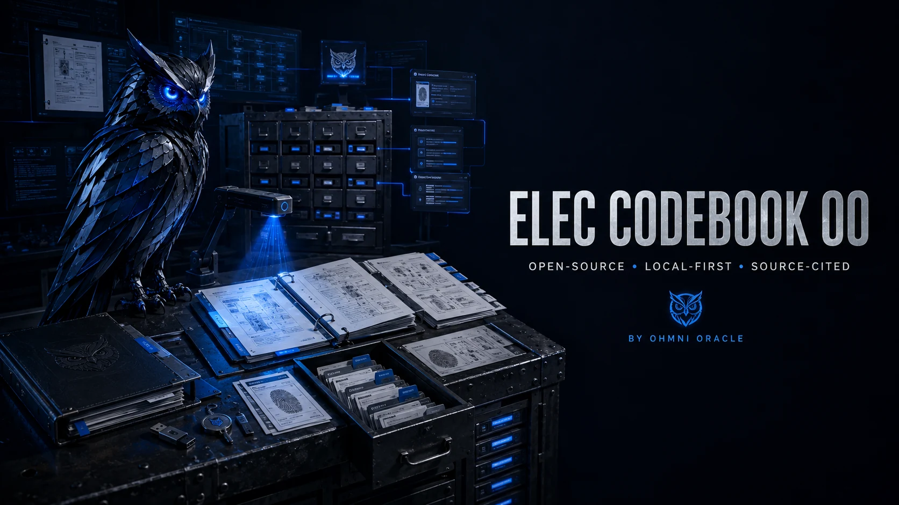

# Elec Codebook OO

<div align="center">
  
</div>

[](https://github.com/BTCElectrician/elec-codebook-oo/actions/workflows/ci.yml)
[](https://www.python.org/downloads/)
[](pyproject.toml)
[](LICENSE)

**Turn an authorized codebook, specification, or technical manual into page-cited local records or
a searchable PostgreSQL/pgvector corpus—without binding ingestion to one search vendor.**

Elec Codebook OO grew from practical NEC/NFPA 70 workflow lessons: edition control, separate PDF
and printed page numbers, article/section context, definitions, tables, and evidence a reader can
verify. The software is generic and includes no NFPA text, PDF, page image, embedding, or index.

```bash
git clone https://github.com/BTCElectrician/elec-codebook-oo.git
cd elec-codebook-oo
python3 -m venv .venv
source .venv/bin/activate
python -m pip install -e '.[pdf,ocr,postgres]'
make doctor
```

There is no supported curl installer or published package release yet. Install from source with pip
or uv.

## TL;DR

**The problem:** Basic PDF-to-text scripts discard the evidence needed for trustworthy retrieval.
They merge pages, lose printed-page mappings, flatten definitions and tables, and couple the result
to whichever database was chosen first.

**The solution:** Elec Codebook OO creates a versioned document contract before storage. Each chunk
retains source identity, PDF page, optional printed page, content type, and article/section context.
The same records can be exported as JSONL or indexed in PostgreSQL with pgvector.

| Capability | What works in v0.3.1 |
| --- | --- |
| Evidence-preserving ingestion | Text, Markdown, native PDF text, and local OCR remain page-local |
| Real OCR fallback | Image-only or low-text PDF pages use local Tesseract with confidence metadata |
| Portable records | Versioned JSON and JSONL with source SHA-256 and explicit locators |
| pgvector indexing | Atomic corpus replacement with stale-record cleanup |
| Hybrid retrieval | PostgreSQL full-text search plus pgvector cosine similarity |
| Grounded answers | Deterministic extracted wording with article, section, PDF page, and printed page |
| Neutral profiles | Generic metadata, content ranges, page offset, backend, and embedding selection |
| Safe operations | Exact no-write apply preview and explicit `--apply` before artifacts or database writes |
| Real verification | Mock-free integration test against a disposable pgvector service |

## Quick example

The bundled source is invented and safe to use:

```bash
make caps-json
make plan
make dry
make ingest
make export
make smoke
```

To exercise the searchable pgvector path:

```bash
python -m pip install -e '.[dev,pdf,ocr,postgres]'
make pgvector-up
make ingest BACKEND=pgvector
make search QUERY="What does the synthetic branch circuit supply?"
make answer QUERY="What does the synthetic branch circuit supply?"
make test-pgvector
make pgvector-down
```

Example result:

```text
Article 1. A branch circuit is a circuit that supplies one or more outlets.
Source: source.txt, Article 1, PDF page 1
```

## Architecture

```text
authorized .txt / .md / .pdf
                     |
                     | metadata-only profile
                     v
             plan / dry validation ---------------- no writes, no connections
                     |
                     | ingest --apply
                     v
        native page extraction
                     |
             usable text? -- no --> local PDFium render
                     |                    |
                    yes             Tesseract OCR
                     |            + confidence/provenance
                     +---------+----------+
                               |
        page-preserving evidence and chunking
                     |
                     v
       CodebookDocument schema v2.1
       - source SHA-256
       - PDF + printed page
       - content type
       - article + section
       - native or labeled OCR-derived evidence text
       - extraction method + OCR confidence
                     |
           +---------+----------+
           |                    |
           v                    v
 local JSON / JSONL      embedding provider
                                |
                                v
                     PostgreSQL + pgvector
                     - GIN full-text index
                     - HNSW vector index
                     - reciprocal-rank fusion
                                |
                      +---------+---------+
                      |                   |
                      v                   v
              search / query          answer
            extracted passages    passages + citations
```

Ingestion owns evidence. A backend owns storage and ranking. The answer layer consumes only
backend-neutral `SearchResult` objects. This is what makes another retrieval adapter possible
without rebuilding the PDF pipeline.

## Evidence contract

Every `CodebookDocument` has:

| Field | Meaning |
| --- | --- |
| `id` | Deterministic identity derived from corpus, source hash, page, chunk, and content |
| `corpus_id` | Profile-controlled corpus name |
| `source_name` / `source_sha256` | Source locator and exact input fingerprint |
| `content` / `search_text` | Evidence wording and metadata-enriched retrieval text |
| `content_type` | `main`, `definitions`, `tables`, `annexes`, or a profile-defined type |
| `pdf_page_start/end` | One-based file-page evidence |
| `printed_page_start/end` | Optional human-visible page mapping |
| `article_*` / `section_*` | Generic heading context when detected |
| `metadata.extraction_method` | `native-text`, `native-pdf-text`, or `ocr-tesseract` |
| `metadata.extraction_confidence` | Mean Tesseract word confidence for OCR-derived text |
| `metadata` | JSON extension point for another manual or downstream schema |
| `schema_version` | Contract version, currently `2.1` |

Chunks never span PDF pages in v0.3.1. That conservative rule keeps citations unambiguous.

## Native extraction and OCR

The old NFPA 70 ETL called its GPT text-correction phase “OCR cleaning,” but its extractor read the
existing PDF text layer and skipped empty pages. Elec Codebook OO v0.3 introduced the missing
capability:
real image OCR.

`ocr.mode=auto` is the default. Native PDF text is retained when it has enough alphanumeric
characters. Only pages below that threshold are rendered locally with PDFium and sent to the local
Tesseract process. `always` forces OCR for every PDF page; `off` disables it.

OCR output is evidence, not unquestionable truth. Every OCR-derived document records its engine and
mean word confidence, and human-readable citations label OCR-derived passages. No PDF page or OCR
text is sent over the network by this path.

## PostgreSQL and pgvector

The implemented pgvector adapter creates:

- `corpora`, storing the source and embedding contract;
- `documents`, storing evidence, metadata, generated `tsvector`, and `vector(1536)`;
- an indexed foreign key from documents to corpora;
- a composite corpus/type/page index;
- a GIN full-text index;
- an HNSW cosine vector index.

Indexing is transactional. Records are upserted, and documents no longer present in the replacement
run are deleted in the same transaction.

Retrieval combines two candidate lists:

1. pgvector cosine similarity;
2. PostgreSQL `websearch_to_tsquery` full-text ranking.

Reciprocal-rank fusion combines them without pretending PostgreSQL reproduces Azure AI Search's
proprietary semantic ranker byte-for-byte.

## Embeddings

| Provider | Status | Intended use |
| --- | --- | --- |
| `hash` | Implemented and tested | Offline tutorial, deterministic tests, plumbing verification |
| `openai` | Optional adapter | Semantic retrieval compatible with the legacy 1,536-dimension contract |

The hash provider is a signed feature-hashing representation. It is useful for exact-term and
overlap-driven local testing; it is not presented as a production semantic model. The selected
provider and model are stored with the corpus, and queries must use that same contract.

The OpenAI adapter batches document inputs while preserving result order. Pgvector ingest verifies
the configured database before making a paid embedding request. Selecting that provider is an
explicit data-boundary decision because document `search_text` is sent to the provider.

## Installation

Elec Codebook OO requires Python 3.11 or newer.

### pip

```bash
git clone https://github.com/BTCElectrician/elec-codebook-oo.git
cd elec-codebook-oo
python3 -m venv .venv
source .venv/bin/activate
python -m pip install -e '.[pdf,ocr,postgres]'
```

Extras are isolated:

```bash
python -m pip install -e '.[pdf]'          # native text extraction with pypdf
python -m pip install -e '.[ocr]'          # PDFium rendering; also install Tesseract
python -m pip install -e '.[postgres]'     # psycopg + pgvector
python -m pip install -e '.[dev]'          # pytest + Ruff
python -m pip install -e '.[ai]'           # optional provider SDK
```

The OCR extra supplies the Python renderer. Install Tesseract separately:

```bash
brew install tesseract                 # macOS
sudo apt-get install tesseract-ocr     # Ubuntu/Debian
```

### uv

```bash
git clone https://github.com/BTCElectrician/elec-codebook-oo.git
cd elec-codebook-oo
uv venv
source .venv/bin/activate
uv pip install -e '.[dev,pdf,ocr,postgres]'
make check
```

### Docker

```bash
make docker-build
make docker-run
make pgvector-up
make test-pgvector
```

See [docs/DOCKER.md](docs/DOCKER.md) for ports, volumes, and teardown.

## Process your own authorized source

1. Confirm that you may process the exact document in the intended way.
2. Copy the generic profile outside the repository:

   ```bash
   cp codebook_agent/profiles/generic-reference-template.json /absolute/path/profile.json
   ```

3. Set its document identity, edition, page ranges, page offset, OCR policy, and backend.
4. Review the questions and plan:

   ```bash
   make ask PROFILE=/absolute/path/profile.json
   make plan PROFILE=/absolute/path/profile.json PDF=/absolute/path/book.pdf \
     BACKEND=pgvector SCHEMA=codebook
   make dry PROFILE=/absolute/path/profile.json PDF=/absolute/path/book.pdf \
     BACKEND=pgvector SCHEMA=codebook
   ```

5. Start or select a non-production PostgreSQL database with pgvector.
6. Only after reviewing the target, ingest:

   ```bash
   make ingest \
     PROFILE=/absolute/path/profile.json \
     PDF=/absolute/path/book.pdf \
     BACKEND=pgvector
   ```

7. Query it:

   ```bash
   make search PROFILE=/absolute/path/profile.json QUERY="What does Section 3.1 require?"
   make answer PROFILE=/absolute/path/profile.json QUERY="What does Section 3.1 require?"
   ```

`plan` and `dry` display the exact local artifact path or PostgreSQL schema plus the effective
embedding provider, model, and future network/data boundary. They do not read the database URL,
connect, write, or construct a provider client. PostgreSQL apply commands read
`CODEBOOK_DATABASE_URL` and never print its value. The Makefile's default URL is only for the
disposable local Compose service.

## Profile configuration

Profiles contain metadata, not source extracts:

```json
{
  "id": "authorized-manual-2026",
  "title": "Authorized Technical Manual",
  "edition": "2026",
  "document_type": "technical-manual",
  "legal_use_required": true,
  "content_ranges": {
    "front_matter": [1, 8],
    "main": [{"start_pdf_page": 9, "end_pdf_page": 420}],
    "definitions": [[421, 435]],
    "tables": [[436, 470]],
    "annexes": []
  },
  "printed_page_offset": 8,
  "max_chunk_chars": 1800,
  "ocr": {
    "mode": "auto",
    "engine": "tesseract",
    "language": "eng",
    "dpi": 300,
    "page_segmentation_mode": 3,
    "min_native_characters": 40,
    "timeout_seconds": 120
  },
  "backend": "pgvector",
  "embedding": {
    "provider": "hash",
    "model": "codebook-hash-v1"
  },
  "questions": [
    "Do you have the right to process this edition locally?",
    "Where is the source?"
  ]
}
```

`printed_page_offset` means `printed page = PDF page - offset`. Pages at or before the offset have
no printed-page value. Range values may be `[start, end]`, `[[start, end], ...]`, or objects with
`start_pdf_page` and `end_pdf_page`.

Read [docs/PROFILE_SCHEMA.md](docs/PROFILE_SCHEMA.md) for the complete contract.

## Command reference

| Command | Connections | Writes | Purpose |
| --- | --- | --- | --- |
| `make help` | None | None | Show the command map |
| `make doctor` | None | None | Check Python, optional extras, and local paths |
| `make caps-json` | None | None | Machine-readable capability and safety contract |
| `make ask` | None | None | Print profile onboarding questions |
| `make plan` | None | None | Preview exact apply destination, provider boundary, and evidence contract |
| `make dry` | None | None | Validate the same apply configuration without clients or writes |
| `make ingest BACKEND=local-artifacts` | None | Local JSON | Apply-gated local ingest |
| `make export` | None | Local JSONL | Export a prior local ingest |
| `make ingest BACKEND=pgvector` | Configured database/provider | PostgreSQL | Apply-gated indexed ingest |
| `make search QUERY="..."` | Configured database/provider | None | Hybrid retrieval |
| `make answer QUERY="..."` | Configured database/provider | None | Exact evidence and citations |
| `make test-ocr` | Local Tesseract | Temporary generated PDF | Real image-only OCR test |
| `make smoke` | None | Temporary directory | Synthetic local evidence test |
| `make test-pgvector` | Disposable local database | Temporary test schema | Real integration test |
| `make check` | None by default | Test caches | Lint, unit tests, smoke, leak guard |
| `make clean` | None | Deletes selected `artifacts/` only | Remove generated local artifacts |

The installed CLI exposes the same controls:

```bash
codebook caps --json
codebook plan --profile /path/profile.json --pdf /path/book.pdf --backend pgvector
codebook ingest --apply --profile /path/profile.json --pdf /path/book.pdf --backend pgvector --ocr-mode auto
codebook search --profile /path/profile.json --query "minimum cover" --json
codebook answer --profile /path/profile.json --query "minimum cover"
```

## Design principles

1. **Evidence precedes vectors.** A ranking backend cannot recover page boundaries discarded during
   extraction.
2. **Behavioral parity, not provider imitation.** Every backend must return the same evidence
   contract even when its ranking algorithm differs.
3. **Plan before apply.** Inspection does not connect to PostgreSQL, load credentials, or write.
4. **Operator-owned content stays outside git.** PDFs, extracts, vectors, indexes, and exports are
   user derivatives.
5. **Capabilities are earned.** A backend is implemented only with adapter code, documentation,
   synthetic tests, and a real-service integration path.

## How it compares

| Approach | Page evidence | Backend-neutral records | Search | Best fit |
| --- | --- | --- | --- | --- |
| **Elec Codebook OO v0.3.1** | Native text + local OCR, PDF + printed page | Yes | PostgreSQL hybrid | Auditable BYO-document workflows |
| One-off PDF script | Often lost | Usually no | No | Disposable extraction |
| Hosted document assistant | Provider-dependent | Usually no | Hosted | Fast use when upload terms are acceptable |
| Direct Azure AI Search pipeline | Schema-dependent | Possible | Managed hybrid | Existing Azure infrastructure |
| Raw pgvector tutorial | Application-defined | Application-defined | Vector only unless extended | Learning vector SQL |

## Limitations

- No protected codebook content or prebuilt index is included.
- OCR is word-oriented Tesseract output; complex diagrams and table geometry still require review.
- Printed-page mapping is profile offset-based; generic footer/header detection is not implemented.
- Heading detection is generic regex-based parsing, not an edition-specific NEC grammar.
- Chunks stay within one PDF page; multi-page tables are not reconstructed into one logical table.
- `hash` embeddings are deterministic plumbing, not production semantic embeddings.
- OpenAI embeddings are optional but are not exercised by credential-free CI.
- Grounded answers are extractive. Generative answer synthesis is not implemented.
- The pgvector schema currently standardizes on 1,536 dimensions for compatibility with the legacy
  corpus contract.
- Azure AI Search, LanceDB, Qdrant, and OpenSearch adapters are not implemented in this repository.
- There is no hosted service, authentication layer, or multi-user authorization model.

## Troubleshooting

### `Source not found`

Pass an absolute existing `.txt`, `.md`, or `.pdf` path.

### `PDF support is optional`

Install the PDF extra:

```bash
python -m pip install -e '.[pdf]'
```

### `Tesseract OCR is required for this page`

Install the OCR Python extra and the local Tesseract executable:

```bash
python -m pip install -e '.[ocr]'
brew install tesseract                 # macOS
sudo apt-get install tesseract-ocr     # Ubuntu/Debian
```

Use `--ocr-mode off` only when you intentionally want native text extraction without fallback.

### `Set CODEBOOK_DATABASE_URL`

Start the disposable service with `make pgvector-up`, or configure a PostgreSQL database you are
authorized to use. Do not place a production URL in a committed file.

### `vector type not found`

Use a PostgreSQL service with the pgvector extension available. The adapter runs
`CREATE EXTENSION IF NOT EXISTS vector`; the database role must be allowed to create or use it.

### Search returns weak matches

Confirm the corpus was indexed with the same embedding provider now used for querying. The local
hash provider relies on token overlap. Use a real semantic embedding provider when semantic
similarity is required.

### Printed pages are missing

Set `printed_page_offset`. The formula is `printed page = PDF page - offset`.

### Leak guard failure

Remove the tracked PDF, extract, page image, JSONL, artifact, embedding dump, or `.env`. Use invented
fixtures in tests and issues.

## FAQ

### Does this repository contain the NEC or NFPA 70?

No. The NFPA-named profile is metadata-only and optional. The default profile is generic.

### Can someone use the same PDF I use?

They bring their own independently authorized copy, create their own profile, and generate their
own local artifacts or pgvector index. This repository does not distribute the document or its
derivatives.

### Does OCR upload my PDF?

No. PDFium renders selected pages in process and Tesseract runs as a local executable. Selecting an
external embedding provider later is a separate, explicit data-boundary decision.

### Is pgvector now implemented?

Yes. The adapter, schema migration, atomic indexing, hybrid retrieval, CLI, and mock-free
integration test are implemented.

### Is Azure required?

No. Azure is not imported or contacted by the implemented workflows.

### Does `answer` interpret the code?

No. It returns ranked extracted wording and citations. It does not replace professional judgment or
claim that a retrieved passage is sufficient for a field decision.

### Can I change the schema for another kind of manual?

Use profile-defined content types and the document `metadata` JSON object for extensions. Changing
the stable evidence fields requires a new document schema version and database migration.

### Do planning commands connect to PostgreSQL?

No. `plan`, `dry`, `ask`, and `caps` are no-connection and no-write commands. Planning resolves
and displays the destination, schema, embedding contract, and future data boundary without reading
the database URL or constructing a provider client.

## About contributions

> *About Contributions:* Please don't take this the wrong way, but I do not accept outside contributions for any of my projects. I simply don't have the mental bandwidth to review anything, and it's my name on the thing, so I'm responsible for any problems it causes; thus, the risk-reward is highly asymmetric from my perspective. I'd also have to worry about other "stakeholders," which seems unwise for tools I mostly make for myself for free. Feel free to submit issues, and even PRs if you want to illustrate a proposed fix, but know I won't merge them directly. Instead, I'll have Claude or Codex review submissions via `gh` and independently decide whether and how to address them. Bug reports in particular are welcome. Sorry if this offends, but I want to avoid wasted time and hurt feelings. I understand this isn't in sync with the prevailing open-source ethos that seeks community contributions, but it's the only way I can move at this velocity and keep my sanity.

Do not attach protected source content, generated derivatives, indexes, credentials, or private
operational data to an issue or pull request. See [CONTRIBUTING.md](CONTRIBUTING.md).

## License

The code and project documentation are available under the [MIT License](LICENSE). That license
does not apply to any book, standard, manual, PDF, page image, extracted text, embedding, or index
processed with the software.

NFPA and National Electrical Code are trademarks of the National Fire Protection Association. This
project is independent and is not affiliated with, endorsed by, or sponsored by NFPA.
